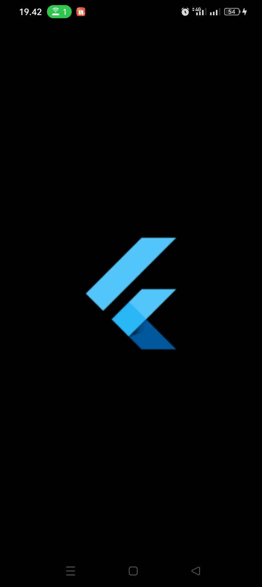
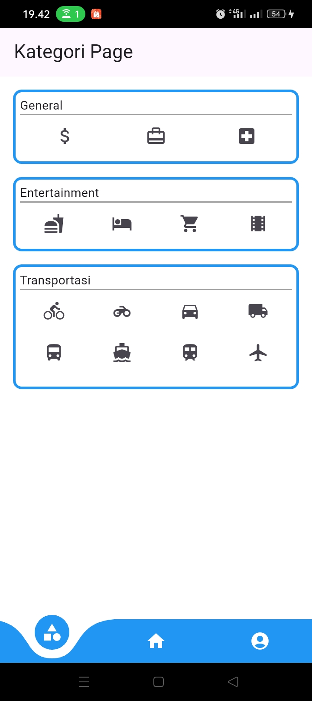
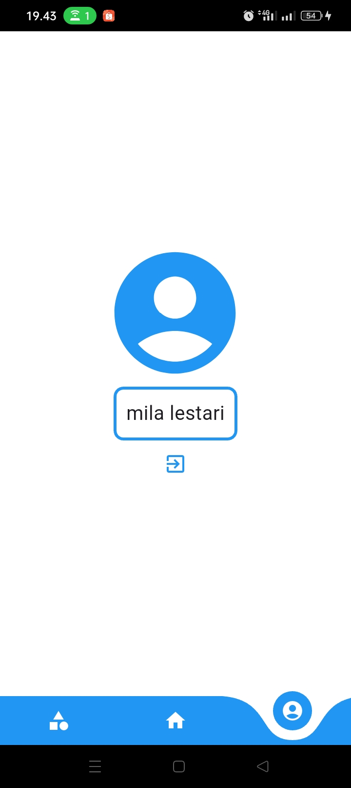

# 📰 Flutter News Portal

Aplikasi Flutter sederhana yang menyajikan portal berita dengan fitur login, registrasi, kategori berita, dan detail berita. Dibuat menggunakan **Visual Studio Code** dan dijalankan pada **mobile emulator** (Android/iOS).

---

## 📌 Fitur Utama

- 🔐 Login dan Registrasi pengguna
- 🗞️ Menampilkan berita terkini dari API
- 🧭 Navigasi bawah menggunakan Curved Navigation Bar
- 📂 Halaman kategori berita
- 🧑 Profil pengguna dengan sesi login
- 🖼️ Halaman detail berita

---

## 🛠️ Tools dan Teknologi

- [Flutter](https://flutter.dev/)
- [Dart](https://dart.dev/)
- [Visual Studio Code](https://code.visualstudio.com/)
- Android/iOS Emulator
- Packages:
  - [`http`](https://pub.dev/packages/http)
  - [`shared_preferences`](https://pub.dev/packages/shared_preferences)
  - [`curved_navigation_bar`](https://pub.dev/packages/curved_navigation_bar)
  - [`fluttertoast`](https://pub.dev/packages/fluttertoast)

---

## 🗂️ Struktur Folder

```
NEWS_PORTAL/
│
├── lib/
│ ├── main.dart # Entry point aplikasi
│ ├── home.dart # Halaman utama dengan API berita
│ ├── kategori.dart # Halaman kategori berita
│ ├── detail.dart # Halaman detail berita
│ ├── formlogin.dart # Halaman login
│ ├── formregist.dart # Halaman registrasi
│ └── profil.dart # Halaman profil pengguna
│
├── asset/ # Folder aset gambar (opsional)
├── android/ # Konfigurasi Android
├── ios/ # Konfigurasi iOS
├── web/ # Support Web (optional)
├── pubspec.yaml # File konfigurasi dependencies
└── README.md # Dokumentasi proyek
```

---

## 🚀 Cara Menjalankan Proyek

### 1. Clone Repository

```
git clone https://github.com/username/news_portal.git
cd news_portal
```

### 2. Install Dependencies

```
flutter pub get
```

### 3. Jalankan Emulator

Pastikan Anda sudah menjalankan Android Emulator atau menghubungkan perangkat fisik.

```
flutter devices
flutter run
```

---

## 📱 Alur Tampilan Aplikasi

1. Login Page - Pengguna memasukkan username dan password
2. Home Page - Menampilkan berita terkini dari TechCrunch API
3. Detail Page - Menampilkan detail berita yang dipilih
4. Kategori Page - Memilih kategori dan menampilkan toast sesuai kategori
5. Profil Page - Menampilkan informasi akun jika sudah login, atau tombol login/sign up jika belum login

---

## 🧪 API yang Digunakan

1. Login / Sign Up API
    - https://e-commerce-store.glitch.me/login
    - https://e-commerce-store.glitch.me/signup

2. News API
    - https://newsapi.org/v2/top-headlines?sources=techcrunch&apiKey=YOUR_API_KEY

Gantilah YOUR_API_KEY di home.dart dengan API key pribadi Anda dari newsapi.org.

---

## 📸 Preview (Opsional)

Berikut adalah tampilan antarmuka pengguna dari aplikasi News Portal:

| Tampilan Login | Tampilan Kategori |
|----------------|-------------------|
|  |  |

| Tampilan Berita | Tampilan Profil |
|------------------|-----------------|
|  |  |
